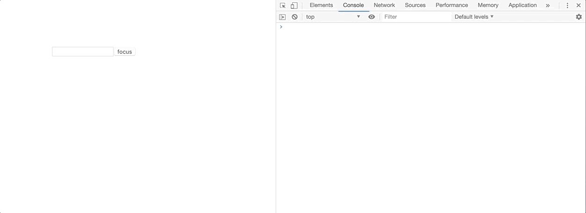

# useRef()的使用

## 使用场景       

&ensp;&ensp;&ensp;&ensp;- 用于获取并存放组件的 dom 节点, 以便直接对 dom 节点进行原生的事件操作，如监听事件等等。

&ensp;&ensp;&ensp;&ensp;- 利用 useRef 解决由于 hooks 函数式组件产生闭包时无法获取最新 state 的问题。

&ensp;&ensp;&ensp;&ensp;- 存放想要持久化( instant )的数据, 该数据不和 react 组件树的渲染绑定。该数据可以是任何类型，数字、数组、对象、函数，都可以。

## 用法

### 获取 dom 节点

&ensp;&ensp;&ensp;&ensp;React 的典型用法是更改 props 来更新UI，但有些情况如触发滚动时回调、获取元素大小等，需要直接获取并存储组件的 dom 节点的引用, 以便对其直接进行操作。



```javascript
import React, { useRef } from 'react'

export default function InputFocus() {
    const inputRef = useRef()

    return <div>
        <input name="input" ref={inputRef}></input>
        <button onClick={() => {
        // 通过 .current 拿到当前 dom 元素
        // 可使用原生 dom 事件
            inputRef.current.focus()
            console.log('ref', inputRef.current)
        }}>
            focus
        </button>
    </div>
}
```


### 解决使用 hooks 时由于闭包无法获取最新 state 的问题

&ensp;&ensp;&ensp;&ensp;用 useRef 解决闭包导致无法获取最新 state 的问题。会出现这样的问题是由于 hooks 组件本质上是一个函数, 不像 class 组件由于可以直接获取到实例变量从而获取到准确的最新值。

&ensp;&ensp;&ensp;&ensp;下图为在 setTimeout 中进行弹窗并显示 state 和 ref.current 的值, 可以看到 state 的数字由于闭包拿到的是上一个版本的 state, 而 ref 的值更新了。


```JavaScript
import React, { useState, useEffect, useRef } from "react"

const RefComponent = () => {
    // 使用 useState 存放和改变展示的 number
    const [stateNumber, setStateNumber] = useState(0)
    // 使用 useRef 生成一个独立的 ref 对象
    // 在它的 current 属性单独存放一个展示的 number, 初始值为 0
    const numRef = useRef(0)

    function incrementAndDelayLogging() {
      // 点击按钮 stateNumber + 1
        setStateNumber(stateNumber + 1)
      // 同时 ref 对象的 current 属性值也 + 1
        numRef.current++
      // 定时器函数中产生了闭包, 这里 stateNumber 的是组件更新前的 stateNumber 对象, 所以值一直会滞后 1
        setTimeout(
            () => alert(`state: ${stateNumber} | ref: ${numRef.current}`),
            1000
        )
    }
    // 直接渲染的组件是正常情况, 可以获取到最新的 state,
    // 所以 ref.current 和 state 存储的值显示一致
    return (
        <div>
            <h1>solving closure by useRef</h1>
            <button onClick={incrementAndDelayLogging}>alert in setTimeout</button>
            <h4>state: {stateNumber}</h4>
            <h4>ref: {numRef.current}</h4>
        </div>
    )
}

export default RefComponent
```


### 其他场景下存放任何想要存的数据

&ensp;&ensp;&ensp;&ensp;可以在任何我们需要的时候更新 ref.current , **并且不会由于它的更新造成 rerender** , 所以在下例中可以用它来计算组件更新次数。

```JavaScript
import React, { useRef } from 'React'

export const RenderCount() {
  const renders = useRef(0)
  console.log('renders:', renders.current++) // 组件每次渲染更新次数
  return <div>Hello</div>
}
```


